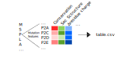

# MutationFeatures

Deriving tabular form features for each possible mutation in a protein.




## Description

A container that takes a protein sequence [.fasta] (and optionally also a [.pdb] file), iterates through all possible amino acid mutations from this wild-type strain, and returns a large number of columns represeting various descriptions of those mutations.

The idea is that this will be a useful tool for those looking to find patterns that distinguish resistance or disease causing mutations for example from the bulk of other mutations.


Features include:

 - Evolutionary: PSSM, conservation,
 - Structural: Disorder, solvent accesibility, secondary structure
 - Physiochemical: Change in charge, hydrophilicity, VDW's radius
 - Ligand: Probability residue is in a pocket, is the residue contacting the msot likely drug pocket.
 - Language embedding of residue: Prot5


When provided only a sequence, only predicted strucrual features are generated.

When provided both a sequence and a pdb file, structural features derived from the structure will be appended (all residues required to be resolved) .


## Usage

For all intents and purposes one can replace "podman" with "docker" below.

Build the container with:
```
git clone https://github.com/ojcharles/MutationFeatures
cd MutationFeatures
podman build . -t mf
```

To run the program you need a few things:

 - A blast database to mount in the container, we currently require uniref50. This can be generated from the downlaoded fasta with 
 - Drop a file say `my.fasta` in ./query, and optionally a file with the same basename such as `my.pdb` too. Then run the following commands.
 - a folder ./temp
 
The resultant csv file will be depositied in the same directory as your query fasta file
```
podman run -e NVIDIA_VISIBLE_DEVICES=1 --rm -it --name mf \
    -v ./db:/db \
    -v ./lib:/mflibs \
    -v ./query:/query \
    -v ./temp:/tmp \
    mf /bin/bash \
    -c "Rscript /scripts/mf.R /query/my.fasta uniref50.fasta 32 1e-7" # query_fasta blast_db_name threads psiblast_eval
```


## Requirements

 - docker or podman
 - a blast formatted database in ./db
```
mkdir ./db
wget -P ./db https://ftp.uniprot.org/pub/databases/uniprot/uniref/uniref50/uniref50.fasta.gz
gunzip uniref50.fasta.gz
makeblastdb -in ./db/uniref50.fasta -parse_seqids -dbtype prot
```


Oscar J charles 2022

