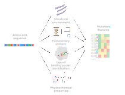

# MutationFeatures

### Deriving tabular form features for each possible mutation in a protein.




## Description

A container that takes a protein sequence [.fasta] (and optionally also a structure [.pdb]). Then returns a table with rows representing each possible AA mutation, and columns representing several unique quantitative approaches to describe of those mutations.

The idea is that this will be a useful tool for those looking to find patterns that distinguish resistance or disease causing mutations for example.


Features include:

 - Evolutionary: residue frequencies, site conservation, site-site co-evolution
 - Structural: disorder, solvent accessibility, secondary structure
 - Physicochemical: change in charge, hydrophobicity, VDW radius
 - Ligand: probability residue is in a pocket, is the residue contacting the most likely drug pocket
 - Language embedding of residue: Prot5


When provided only a sequence, only predicted structural features are generated.

When provided both a sequence and a pdb file, structural features derived from the structure will be appended (all residues required to be resolved).


## Usage

For all intents and purposes one can replace "podman" with "docker" below.


To run the program you need a few things:
 - A linux environment with podman and ncbi-blast installed
 - The code for MutationFeatures & to be in that directory
    ```
    git clone https://github.com/ojcharles/MutationFeatures
    cd MutationFeatures
    ```
 - Generate the subfolders ./db, ./query, ./temp
 - A blast database to mount in the container. MutaionFeatures currently requires uniref50
    ```
    mkdir ./db
    wget -P ./db https://ftp.uniprot.org/pub/databases/uniprot/uniref/uniref50/uniref50.fasta.gz
    gunzip uniref50.fasta.gz
    makeblastdb -in ./db/uniref50.fasta -parse_seqids -dbtype prot
    ```

Then you can build the container by running the command:
    ```
    podman build . -t mf
    ```


To run MutationFeatures against a query protein,  drop a file say `my.fasta` in ./query, and optionally a file with the same basename such as `my.pdb` (ensure the PDB file contains all residues in the protein primary sequence, such as those produced by alphafold) Then run the following command:

```
podman run -e NVIDIA_VISIBLE_DEVICES=1 --rm -it --name mf \
    -v ./db:/db \
    -v ./lib:/mflibs \
    -v ./query:/query \
    -v ./temp:/tmp \
    mf /bin/bash \
    -c "Rscript /scripts/mf.R /query/my.fasta uniref50.fasta 32 1e-7" # query_fasta blast_db_name threads psiblast_eval
```
"-e NVIDIA_VISIBLE_DEVICES=1" is optional

The resultant csv file will be deposited in the same directory as your query FASTA file. This will contain a row for every possible mutaiton, and columns representing a featurespace suitable for Machine Learning.


Oscar J Charles 2022

